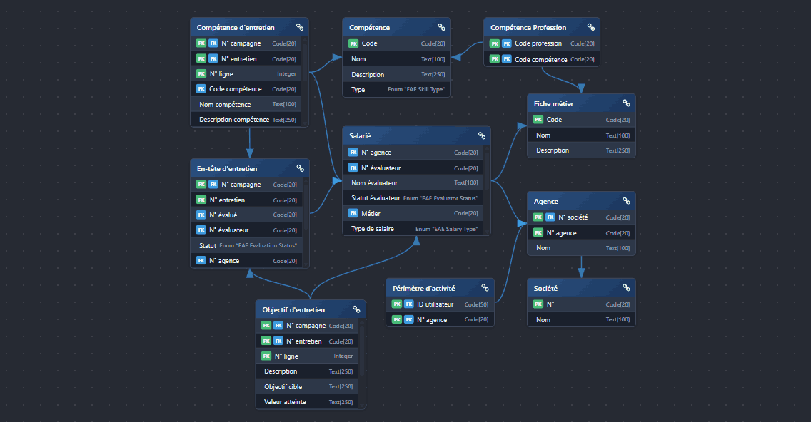

# AL DB Schema

Generate database schema diagrams from Business Central AL projects inside VS Code.



## Features

- Scans `table` and `tableextension` objects from `.al` files.
- Uses captions when available; falls back to object names.
- Robust parsing: supports both quoted and unquoted AL identifiers for objects, fields and keys.
- Project-specific prefix stripping: the scanner reads `CRS.ObjectNamePrefix` from the `.vscode/settings.json` file.
- Auto-detects relationships via `TableRelation` properties and resolves relation targets.

## Usage

1. From an AL project folder,
2. Open Command Palette: `Ctrl+Shift+P`.
3. Run the following command: 
```bash
AL DB Schema: Generate Database Schema
```
4. Use the drawer to toggle tables visibility.
5. Use `Auto` to re-layout the selected tables to fit the view.
6. Use the search box to highlight tables/fields.